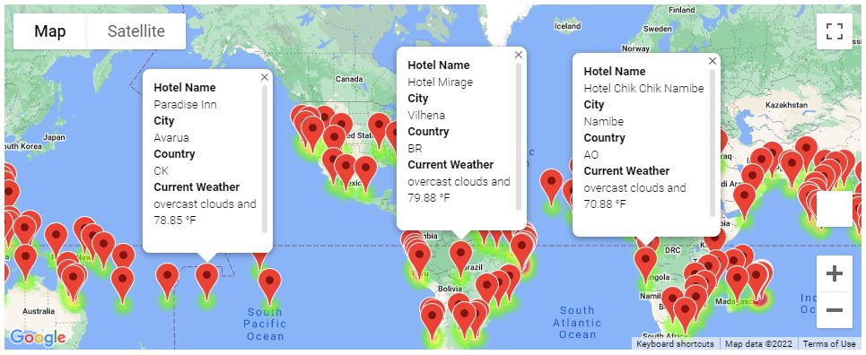
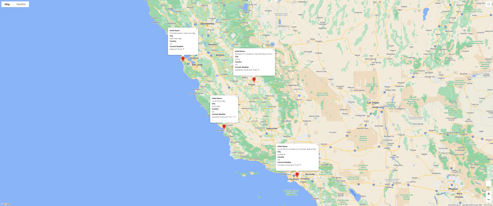
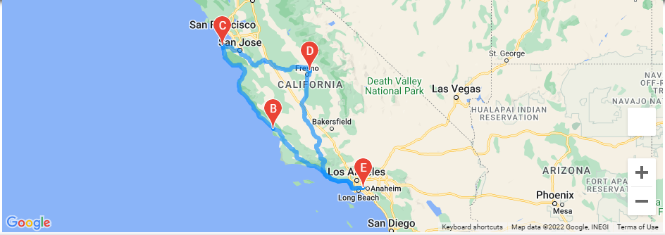

# World_Weather_Analysis

WeatherPy, GMaps with Jupyter Notebook

## Goal

Produce a travel itinerary using four cities from our data set of cities meeting the temperature requirements.

To meet this goal within Jupyter Notebook a combination of Python libraries and modules were used.

* Pandas
* Gmaps
* request
* numpy
* random

Above are a few examples.  Of most importance was retrieving data from APIs, using data from WeatherPy and Google Maps allowed this script to come together.

This would not be possible without parsing through JSON to understand how to retrieve data and compiling a list of locations around the world meeting the requirements.  Not only was a list built but the weather data was also compiled to help make more informed decisions.

Before coming up with the goal, the groundwork required using Matplotlib to create various scatter plots.  The plots then were taken a step further and complimented with regression lines to further help interpret the data.

Using heatmaps also highlighted the destinations meeting vacation criteria.  Calling on googles API was helpful to visualize the possibilities.

## Highlights

Creating a travel destination map using gmaps and adding markers with data for quick destination picks proved to be a valubale tool.

We settled on selecting four cities in the west coast, specifially California.

From there we planned our route to tour these cites as shown below.

